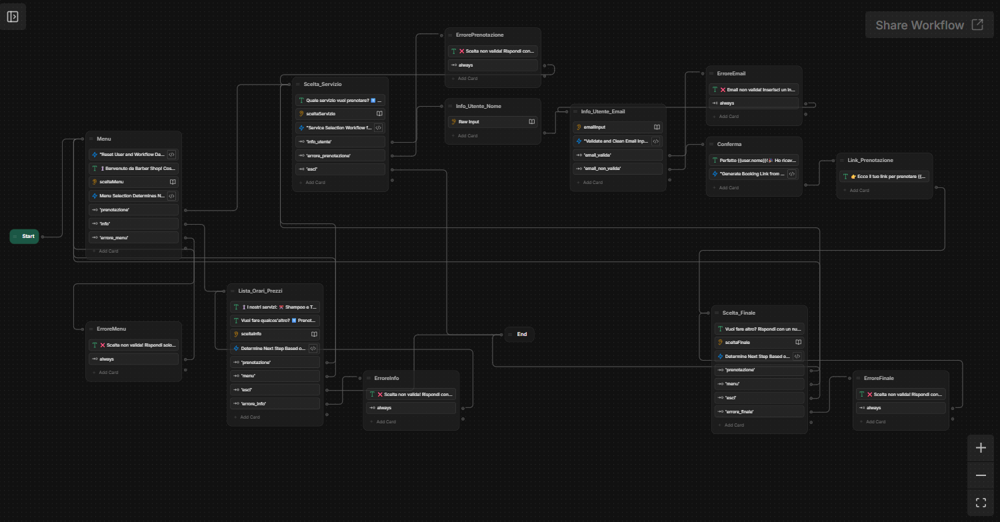
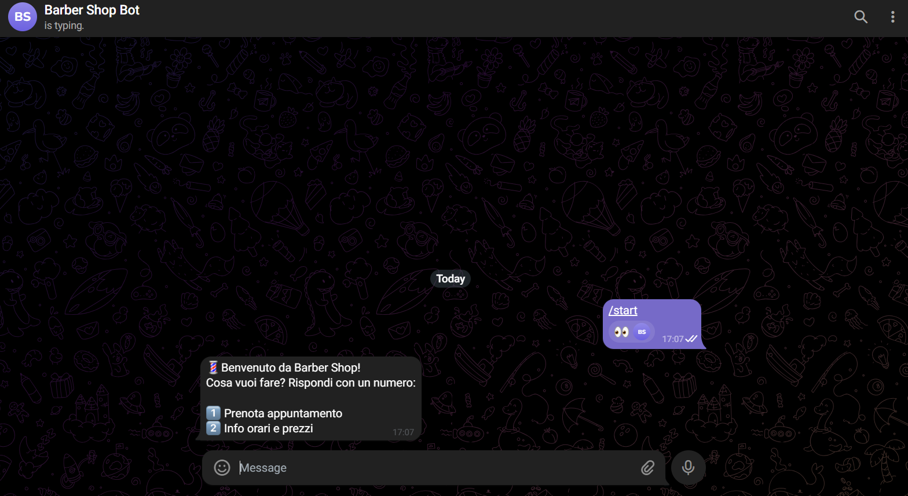
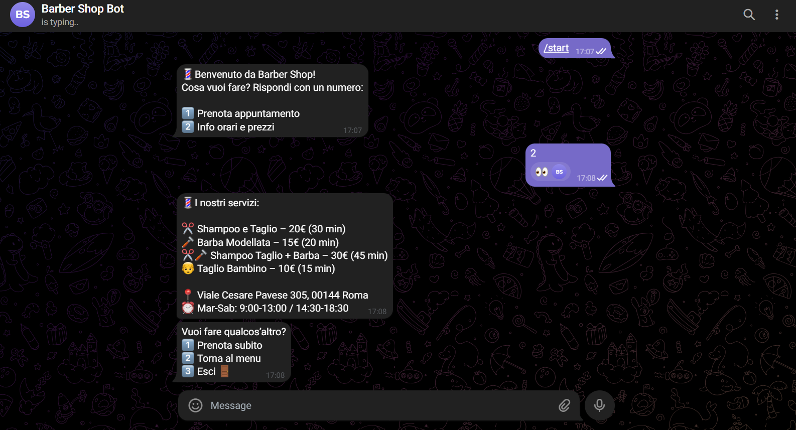
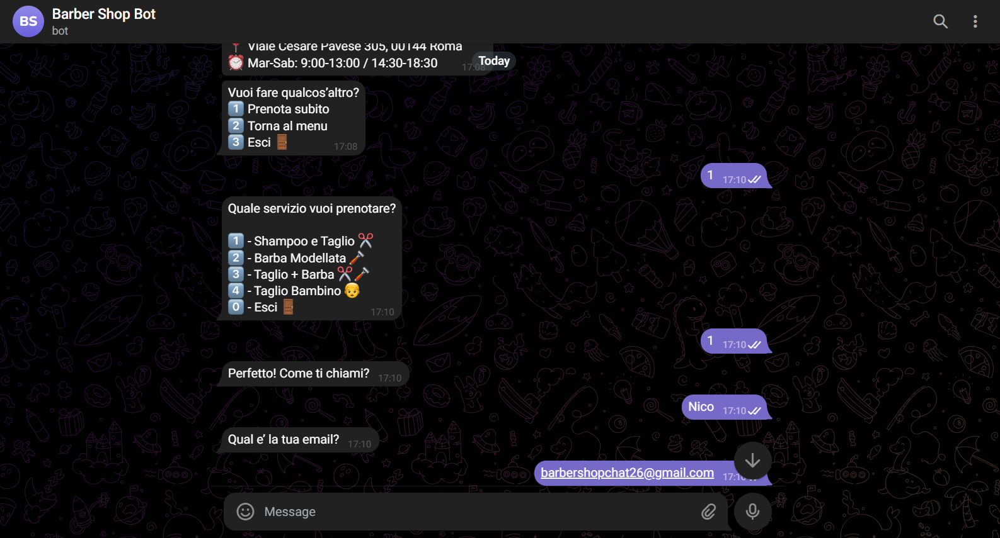
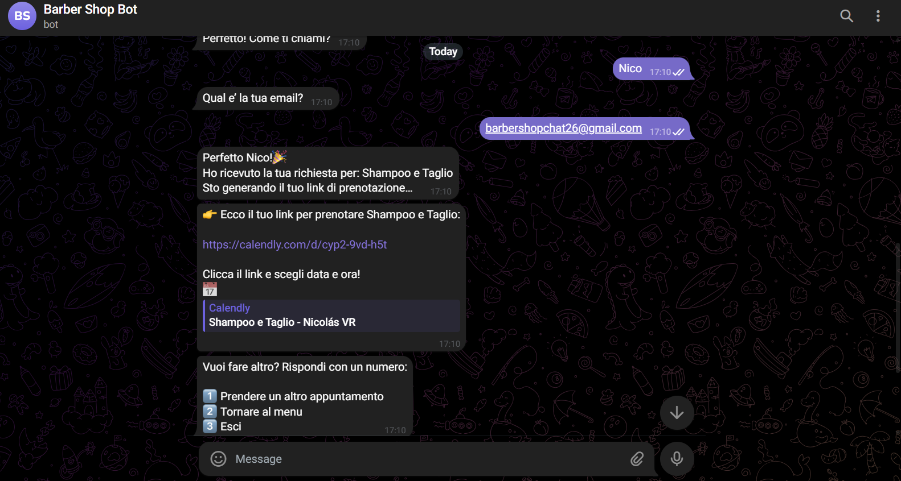
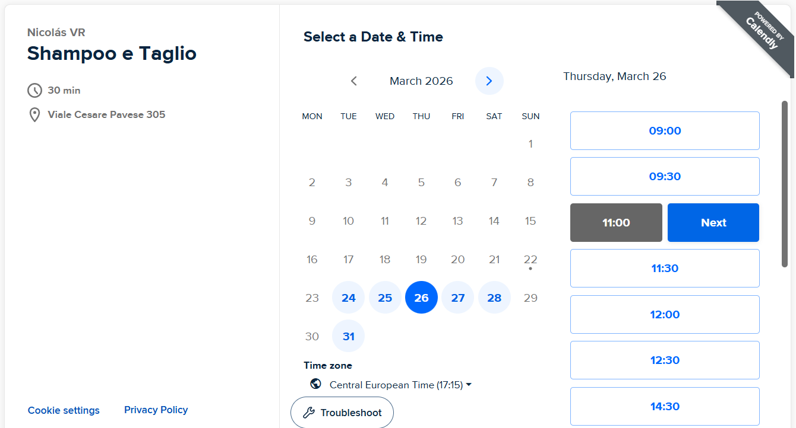
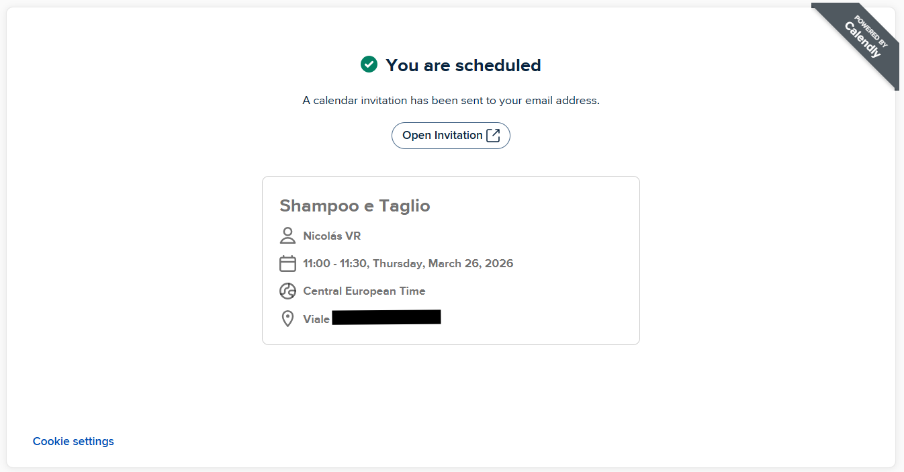
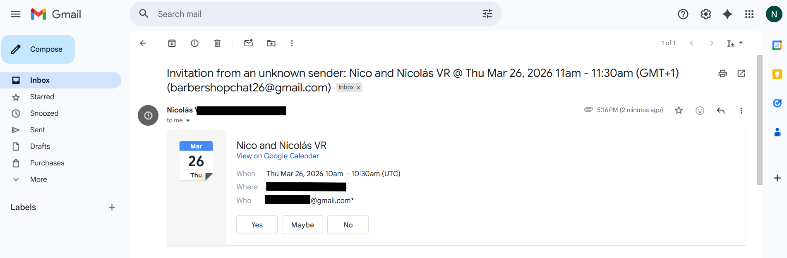
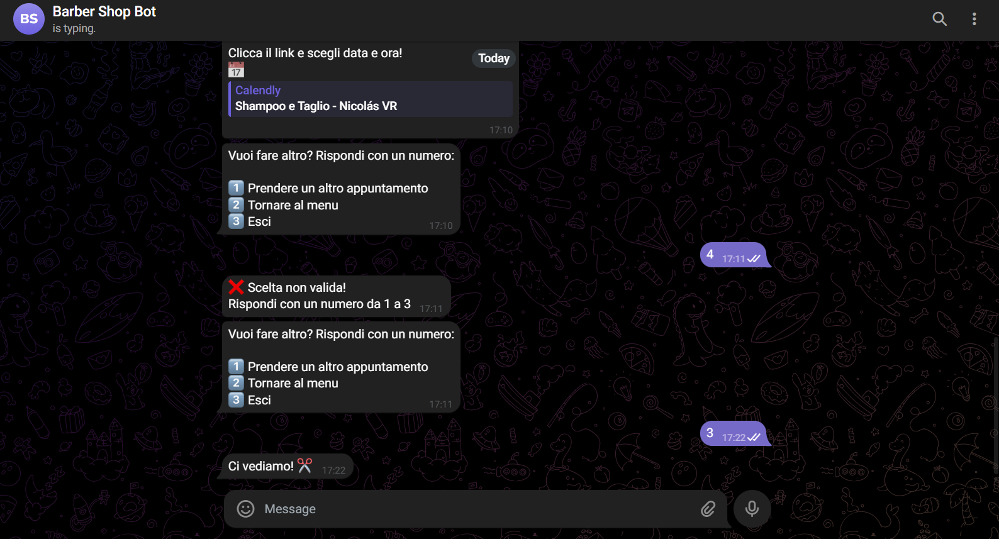

# 💈 Barber Shop Chatbot

> 🇮🇹 [Italiano](#-descrizione) | 🇬🇧 [English](#-description)

---

## 🇮🇹 Descrizione

Chatbot conversazionale per una barberia su Telegram con integrazione reale delle API di Calendly per la prenotazione di appuntamenti. Il bot guida l'utente nella scelta del servizio, raccoglie nome ed email, e genera un link di prenotazione personalizzato direttamente in chat.

### 🤖 Prova il bot

👉 **[@barbershop_nico_bot](https://t.me/barbershop_nico_bot)**

---

## 🛠️ Stack Tecnologico

| Strumento | Utilizzo |
|-----------|---------|
| [Botpress](https://botpress.com) | Costruzione del flusso conversazionale e hosting del bot |
| [Calendly API](https://developer.calendly.com) | Gestione appuntamenti e generazione link di prenotazione |
| [Telegram Bot API](https://core.telegram.org/bots/api) | Canale di messaggistica |

---

## ✨ Funzionalità

- 🗓️ **Prenotazione in tempo reale** — genera un link Calendly univoco per ogni utente
- 💬 **Supporto multilingua** — risponde nella lingua dell'utente (italiano, inglese, spagnolo, ecc.)
- ✅ **Validazione input** — valida il formato dell'email prima di procedere
- ❌ **Gestione errori** — gestisce input non validi in ogni fase del flusso
- 📋 **Menu servizi** — l'utente può scegliere tra 4 servizi diversi
- ℹ️ **Sezione info** — mostra prezzi, orari e indirizzo della barberia

---

## 🔄 Flusso Conversazionale

```
Utente invia messaggio
    ↓
Messaggio di benvenuto + Menu principale
    ↓
[1] Prenota appuntamento        [2] Info orari e prezzi
    ↓                                   ↓
Scelta servizio                 Mostra servizi, prezzi
    ↓                              e orari di apertura
Inserimento nome ed email               ↓
    ↓                       [1] Prenota  [2] Menu  [3] Esci
Generazione link Calendly via API
    ↓
Utente prenota su Calendly
    ↓
Email di conferma inviata automaticamente
```

---

## 📦 Servizi Disponibili

| Servizio | Durata | Prezzo |
|----------|--------|--------|
| ✂️ Shampoo e Taglio | 30 min | 20€ |
| 🪒 Barba Modellata | 20 min | 15€ |
| ✂️🪒 Shampoo Taglio + Barba | 45 min | 30€ |
| 👦 Taglio Bambino | 15 min | 10€ |

---

## 💻 Codice

### Reset variabili — Nodo Menu
Ogni volta che l'utente torna al menu principale, le variabili vengono azzerate per garantire un flusso pulito.

```javascript
user.email = null
user.nome = null
workflow.emailValida = null
workflow.userEmail = null
workflow.bookingLink = null
```

### Smistamento menu principale
```javascript
const scelta = (workflow.sceltaMenu + '').trim()

if (scelta === '1') {
  workflow.prossimoPasso = 'prenotazione'
} else if (scelta === '2') {
  workflow.prossimoPasso = 'info'
} else {
  workflow.prossimoPasso = 'errore_menu'
}
```

### Scelta servizio con gestione uscita
```javascript
const scelta = (workflow.sceltaServizio + '').trim()
const servizi = {
  '1': 'Shampoo e Taglio',
  '2': 'Barba Modellata',
  '3': 'Taglio + Barba',
  '4': 'Taglio Bambino'
}

if (scelta === '0') {
  workflow.prossimoPasso = 'esci'
} else if (servizi[scelta]) {
  user.servizio = servizi[scelta]
  workflow.prossimoPasso = 'avanti'
} else {
  workflow.prossimoPasso = 'errore_servizio'
}
```

### Validazione email
Gestisce anche il formato markdown che Telegram a volte applica automaticamente agli indirizzi email.

```javascript
const raw = (workflow.emailInput + '').trim()

// Rimuove il formato markdown link: [email](mailto:email) → email
const cleaned = raw.replace(/\[([^\]]+)\]\(mailto:[^\)]+\)/g, '$1').trim().toLowerCase()

const emailRegex = /^[a-zA-Z0-9._%+\-]+@[a-zA-Z0-9.\-]+\.[a-zA-Z]{2,}$/

if (!cleaned || cleaned === 'null') {
  workflow.emailValida = false
  return
}

if (emailRegex.test(cleaned)) {
  user.email = cleaned
  workflow.emailValida = true
} else {
  workflow.emailInput = null
  workflow.emailValida = false
}
```

### Generazione link Calendly — 3 chiamate API in sequenza
```javascript
workflow.bookingLink = 'Iniziato...'

try {
  // Step 1: ottieni User URI
  const meRes = await fetch('https://api.calendly.com/users/me', {
    headers: {
      'Authorization': 'Bearer ' + env.CALENDLY_TOKEN,
      'Content-Type': 'application/json'
    }
  })
  const meData = await meRes.json()
  const userUri = meData.resource.uri

  // Step 2: ottieni gli Event Types
  const eventsRes = await fetch('https://api.calendly.com/event_types?user=' + encodeURIComponent(userUri), {
    headers: {
      'Authorization': 'Bearer ' + env.CALENDLY_TOKEN,
      'Content-Type': 'application/json'
    }
  })
  const eventsData = await eventsRes.json()

  // Step 3: trova il servizio scelto e genera il link
  const servizio = user.servizio || ''
  const event = eventsData.collection.find(e =>
    e.name.toLowerCase().includes(servizio.toLowerCase().replace(/[^\w\s]/g, '').trim())
  ) || eventsData.collection[0]

  const linkRes = await fetch('https://api.calendly.com/scheduling_links', {
    method: 'POST',
    headers: {
      'Authorization': 'Bearer ' + env.CALENDLY_TOKEN,
      'Content-Type': 'application/json'
    },
    body: JSON.stringify({
      max_event_count: 1,
      owner: event.uri,
      owner_type: 'EventType'
    })
  })
  const linkData = await linkRes.json()
  workflow.bookingLink = linkData.resource.booking_url

} catch (err) {
  workflow.bookingLink = 'Errore: ' + err.message + ' | ' + (err.stack || '')
}
```

---

## ⚙️ Setup e Replica

Per replicare questo progetto hai bisogno di:

1. **Account Botpress** (gratuito) → [botpress.com](https://botpress.com)
2. **Account Calendly** con accesso API → [calendly.com](https://calendly.com)
3. **Bot Telegram** creato tramite [@BotFather](https://t.me/botfather)

### Passi

1. Crea un account Botpress e un nuovo bot
2. Crea gli Event Types su Calendly (uno per servizio)
3. Genera un Personal Access Token Calendly con gli scope **Scheduling** e **User management**
4. Installa l'integrazione Telegram in Botpress e incolla il Bot Token
5. Aggiungi `CALENDLY_TOKEN` come Configuration Variable in Botpress
6. Costruisci il flusso conversazionale seguendo la struttura descritta
7. Pubblica il bot

---

## 📸 Screenshots

| | |
|--|--|
|  |  |
|  |  |
|  |  |
|  |  |
|  | |

---

## ⚠️ Limitazioni Note

- Il piano gratuito di Calendly supporta solo 1 Event Type attivo — è necessario un piano a pagamento per più servizi
- Twilio WhatsApp Sandbox è stato inizialmente testato ma abbandonato a causa di un bug noto con il typing indicator (`typing: true`) che causava errori HTTP 400 — è stato usato Telegram come alternativa
- Il Translator Agent funziona meglio con messaggi di 3+ token

---

## 🚀 Sviluppi Futuri

- Integrazione webhook per conferma prenotazione in tempo reale su Telegram
- Pannello admin per la gestione degli appuntamenti
- Notifiche promemoria automatiche
- Integrazione WhatsApp Business API (richiede verifica Meta Business)
- Integrazione pagamenti

---

---

## 🇬🇧 Description

Conversational chatbot for a barbershop on Telegram with real Calendly API integration for appointment booking. The bot guides users through service selection, collects their name and email, and generates a personalized booking link directly in the chat.

### 🤖 Try the bot

👉 **[@barbershop_nico_bot](https://t.me/barbershop_nico_bot)**

---

## 🛠️ Tech Stack

| Tool | Purpose |
|------|---------|
| [Botpress](https://botpress.com) | Conversational flow builder and bot hosting |
| [Calendly API](https://developer.calendly.com) | Appointment scheduling and booking link generation |
| [Telegram Bot API](https://core.telegram.org/bots/api) | Messaging channel |

---

## ✨ Features

- 🗓️ **Real-time booking** — generates a unique Calendly link for each user
- 💬 **Multilingual support** — responds in the user's language (Italian, English, Spanish, etc.)
- ✅ **Input validation** — validates email format before proceeding
- ❌ **Error handling** — manages invalid inputs at every step
- 📋 **Service menu** — users can choose from 4 different barbershop services
- ℹ️ **Info section** — displays prices, hours, and location

---

## 🔄 Conversation Flow

```
User sends message
    ↓
Welcome message + Main menu
    ↓
[1] Book appointment          [2] Info & prices
    ↓                               ↓
Choose service              Show services, prices
    ↓                          and opening hours
Enter name and email               ↓
    ↓                     [1] Book  [2] Menu  [3] Exit
Generate Calendly link via API
    ↓
User books on Calendly
    ↓
Confirmation email sent automatically
```

---

## 📦 Services Available

| Service | Duration | Price |
|---------|----------|-------|
| ✂️ Shampoo e Taglio | 30 min | 20€ |
| 🪒 Barba Modellata | 20 min | 15€ |
| ✂️🪒 Shampoo Taglio + Barba | 45 min | 30€ |
| 👦 Taglio Bambino | 15 min | 10€ |

---

## ⚙️ Setup & Replication

To replicate this project you will need:

1. **Botpress account** (free) → [botpress.com](https://botpress.com)
2. **Calendly account** with API access → [calendly.com](https://calendly.com)
3. **Telegram Bot** created via [@BotFather](https://t.me/botfather)

### Steps

1. Create a Botpress account and a new bot
2. Create Event Types on Calendly (one per service)
3. Generate a Calendly Personal Access Token with **Scheduling** and **User management** scopes
4. Install the Telegram integration in Botpress and paste the Bot Token
5. Add `CALENDLY_TOKEN` as a Configuration Variable in Botpress
6. Build the conversation flow following the structure described above
7. Publish the bot

---

## ⚠️ Known Limitations

- Calendly free plan supports only 1 active Event Type — a paid plan is required for multiple services
- Twilio WhatsApp Sandbox was initially tested but abandoned due to a known bug with the typing indicator (`typing: true`) causing HTTP 400 errors — Telegram was used instead
- The Translator Agent works best with messages of 3+ tokens

---

## 🚀 Future Improvements

- Webhook integration for real-time booking confirmation on Telegram
- Admin panel for managing appointments
- Automatic reminder notifications
- WhatsApp Business API integration (requires Meta Business verification)
- Payment integration

---

## 👨‍💻 Author

**Nicolás VR**
Academic project — ITS ICT Academy
March 2026
